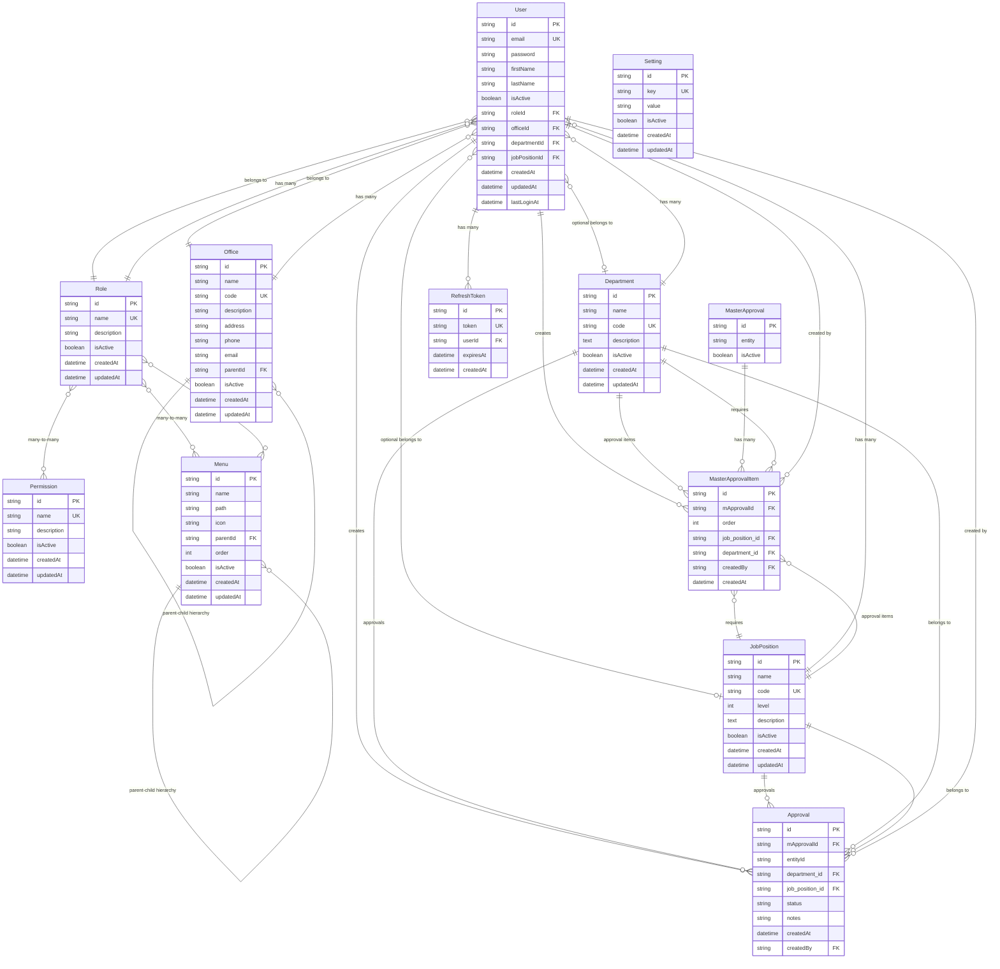

# Entity Relationship Diagram (ERD) Guidelines

## Overview

This document provides comprehensive guidelines for understanding and working with the database schema of the Office Nexus Admin Panel backend system. The ERD serves as a visual and conceptual guide for developers, AI assistants, and system architects.

## Database Schema Summary

The system uses **PostgreSQL** with **Prisma ORM** and follows a hierarchical, role-based access control (RBAC) architecture with approval workflows.

### Core Entities

1. **User Management**: Users, Roles, Permissions
2. **Organizational Structure**: Offices, Departments, Job Positions  
3. **Navigation & Access**: Menus, Role-Menu relationships
4. **Approval System**: Master Approvals, Approval Items, Transaction Approvals
5. **System Configuration**: Settings, Refresh Tokens

## Entity Relationship Diagram (Mermaid)



## Entity Descriptions

### 1. User Management

#### User
- **Primary Entity**: Central user management
- **Key Fields**: email (unique), roleId, officeId
- **Optional Fields**: departmentId, jobPositionId
- **Relationships**: 
  - Required: Role, Office
  - Optional: Department, JobPosition
  - One-to-Many: RefreshTokens, CreatedApprovalItems, CreatedApprovals

#### Role
- **Purpose**: Role-based access control
- **Key Fields**: name (unique)
- **Relationships**: 
  - Many-to-Many: Permissions, Menus
  - One-to-Many: Users

#### Permission
- **Purpose**: Granular access control
- **Key Fields**: name (unique)
- **Relationships**: Many-to-Many with Roles

### 2. Organizational Structure

#### Office
- **Purpose**: Hierarchical office structure
- **Key Fields**: code (unique), parentId (self-reference)
- **Relationships**: 
  - Self-referencing hierarchy (parent-child)
  - One-to-Many: Users

#### Department
- **Purpose**: Organizational departments
- **Key Fields**: code (unique)
- **Relationships**: 
  - One-to-Many: Users, MasterApprovalItems, Approvals

#### JobPosition
- **Purpose**: Job positions with hierarchy levels
- **Key Fields**: code (unique), level (integer)
- **Relationships**: 
  - One-to-Many: Users, MasterApprovalItems, Approvals

### 3. Navigation & Access

#### Menu
- **Purpose**: Dynamic navigation system
- **Key Fields**: parentId (self-reference), order (integer)
- **Relationships**: 
  - Self-referencing hierarchy (parent-child)
  - Many-to-Many with Roles

### 4. Approval System

#### MasterApproval
- **Purpose**: Approval workflow templates
- **Key Fields**: entity (string identifier)
- **Relationships**: One-to-Many with MasterApprovalItem

#### MasterApprovalItem
- **Purpose**: Approval workflow steps
- **Key Fields**: order (integer), mApprovalId, job_position_id, department_id
- **Relationships**: 
  - Belongs to: MasterApproval, JobPosition, Department, User (creator)

#### Approval
- **Purpose**: Transaction-level approvals
- **Key Fields**: entityId, status, notes
- **Relationships**: 
  - Belongs to: Department, JobPosition, User (creator)

### 5. System Configuration

#### Setting
- **Purpose**: Application configuration
- **Key Fields**: key (unique), value

#### RefreshToken
- **Purpose**: JWT refresh token management
- **Key Fields**: token (unique), userId, expiresAt
- **Relationships**: Belongs to User

## Relationship Patterns

### 1. Hierarchical Relationships
- **Office**: Self-referencing parent-child hierarchy
- **Menu**: Self-referencing parent-child hierarchy

### 2. Many-to-Many Relationships
- **Role ↔ Permission**: Roles can have multiple permissions
- **Role ↔ Menu**: Roles can access multiple menus
- **Menu ↔ Role**: Menus can be accessed by multiple roles

### 3. Optional Relationships
- **User → Department**: Optional (nullable)
- **User → JobPosition**: Optional (nullable)

### 4. Audit Relationships
- **User → MasterApprovalItem**: Tracks who created approval items
- **User → Approval**: Tracks who created approvals

## Database Constraints

### Primary Keys
- All entities use UUID primary keys (`@id @default(uuid())`)

### Unique Constraints
- `users.email` - Unique email addresses
- `roles.name` - Unique role names
- `permissions.name` - Unique permission names
- `offices.code` - Unique office codes
- `departments.code` - Unique department codes
- `job_positions.code` - Unique job position codes
- `refresh_tokens.token` - Unique refresh tokens
- `settings.key` - Unique setting keys

### Foreign Key Constraints
- **Cascade Updates**: All foreign keys use `ON UPDATE CASCADE`
- **Restrict Deletes**: Most foreign keys use `ON DELETE RESTRICT`
- **Set Null Deletes**: Optional relationships use `ON DELETE SET NULL`

## Data Flow Patterns

### 1. User Authentication Flow
```
User → Role → Permissions → Menu Access
```

### 2. Organizational Hierarchy
```
Office (Parent) → Office (Child) → Users
Department → Users
JobPosition → Users
```

### 3. Approval Workflow
```
MasterApproval → MasterApprovalItem → Approval
                ↓
            JobPosition + Department + User
```

## AI Assistant Guidelines

### When Working with This Schema:

1. **Always Consider Relationships**: When querying users, include related entities (role, office, department, jobPosition)

2. **Respect Hierarchies**: 
   - Office hierarchy affects user access
   - Menu hierarchy affects navigation structure

3. **Handle Optional Fields**: 
   - departmentId and jobPositionId are nullable
   - Always check for null values

4. **Use Proper Joins**: 
   - Include related data in queries
   - Use Prisma's `include` or `select` for related entities

5. **Consider Soft Deletes**: 
   - Most entities have `isActive` field
   - Filter by `isActive: true` for active records

6. **Audit Trail**: 
   - Track who created/modified records
   - Use `createdBy` fields in approval system

### Common Query Patterns:

```typescript
// Get user with all relationships
const user = await prisma.user.findUnique({
  where: { id: userId },
  include: {
    role: true,
    office: true,
    department: true,
    jobPosition: true
  }
});

// Get active users in an office hierarchy
const users = await prisma.user.findMany({
  where: {
    isActive: true,
    office: {
      OR: [
        { id: officeId },
        { parentId: officeId }
      ]
    }
  }
});

// Get menus accessible by role
const menus = await prisma.menu.findMany({
  where: {
    isActive: true,
    roles: {
      some: { id: roleId }
    }
  },
  orderBy: { order: 'asc' }
});
```

## Migration Guidelines

### When Adding New Entities:
1. Follow the established naming conventions
2. Include standard fields: `id`, `createdAt`, `updatedAt`, `isActive`
3. Use appropriate foreign key constraints
4. Add unique constraints where needed
5. Update seed files for new entities

### When Modifying Existing Entities:
1. Consider impact on existing relationships
2. Update related seed files
3. Test migration with existing data
4. Update DTOs and services accordingly

## Security Considerations

### Data Protection:
- Passwords are hashed (not stored in plain text)
- Sensitive fields excluded from DTOs
- Role-based access control enforced

### Audit Requirements:
- Track creation and modification timestamps
- Track who created approval items
- Maintain user activity logs

This ERD serves as the authoritative reference for understanding the database structure and relationships in the Office Nexus Admin Panel system. Use it to guide development, debugging, and system understanding. 🚀
