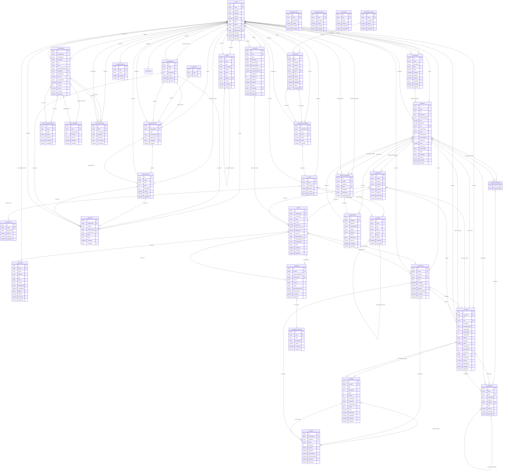

# Entity Relationship Diagram (ERD) Guidelines

## Overview

This document provides comprehensive guidelines for understanding and working with the database schema of the BurangrangAdmin Panel backend system with integrated Digital Product Ecommerce capabilities. The ERD serves as a visual and conceptual guide for developers, AI assistants, and system architects.

## Database Schema Summary

The system uses **PostgreSQL** with **Prisma ORM** and follows a comprehensive architecture combining administrative management with ecommerce and Learning Management System (LMS) capabilities.

### Core Entities

1. **User Management**: Users, Roles, Permissions, Customers
2. **Organizational Structure**: Offices, Departments, Job Positions  
3. **Navigation & Access**: Menus, Role-Menu relationships
4. **Approval System**: Master Approvals, Approval Items, Transaction Approvals
5. **Ecommerce Core**: Products, Categories, Orders, Order Items, Customers
6. **LMS System**: Courses, Chapters, Progress Tracking, Course Enrollments
7. **Discount System**: Coupons, Discounts, Promotions
8. **Digital Assets**: Product Files, Video Embeds, Download Tracking
9. **Payment System**: Transactions, Payment Methods
10. **Notification System**: Notifications, Notification Types, Notification Recipients
11. **File Management**: File Uploads, Storage Providers, File Categories, Access Logs
12. **System Configuration**: Settings, Refresh Tokens

## Database Table Structure Overview

```
┌─────────────────────────────────────────────────────────────────┐
│                    DATABASE TABLES                              │
├─────────────────────────────────────────────────────────────────┤
│  MASTER DATA TABLES (m_ prefix)                                │
│  ┌─────────────┬─────────────┬─────────────┬─────────────┐     │
│  │ m_roles     │ m_permissions│ m_menus    │ m_offices   │     │
│  │ m_departments│ m_job_positions│ m_approval│ m_approval_item││
│  │ m_settings  │ m_product_types│ m_notification_types│ m_categories││
│  │ m_file_storage_providers│ m_file_categories│ m_payment_methods││
│  └─────────────┴─────────────┴─────────────┴─────────────┘     │
├─────────────────────────────────────────────────────────────────┤
│  TRANSACTIONAL DATA TABLES (t_ prefix)                         │
│  ┌─────────────┬─────────────┬─────────────┬─────────────┐     │
│  │ t_users     │ t_refresh_tokens│ t_approvals│ t_notifications││
│  │ t_notification_recipients│ t_courses │ t_chapters   │     │
│  │ t_file_uploads│ t_file_access_logs│ t_products │ t_product_files││
│  │ t_product_downloads│ t_customers│ t_orders│ t_order_items││
│  │ t_payments  │ t_enrollments│ t_progress │             │     │
│  └─────────────┴─────────────┴─────────────┴─────────────┘     │
├─────────────────────────────────────────────────────────────────┤
│  JUNCTION TABLES                                                │
│  ┌─────────────┬─────────────┬─────────────┬─────────────┐     │
│  │ _PermissionToRole│ _MenuToRole│ _ProductToCategory│           │     │
│  └─────────────┴─────────────┴─────────────┴─────────────┘     │
└─────────────────────────────────────────────────────────────────┘
```

## Entity Relationship Diagram (Mermaid)


```mermaid
erDiagram
    %% Core User Management
    t_users {
        string id PK
        string email UK
        string password
        string firstName
        string lastName
        boolean isActive
        string roleId FK
        string officeId FK
        string departmentId FK
        string jobPositionId FK
        datetime createdAt
        datetime updatedAt
        datetime lastLoginAt
    }

    t_customers {
        string id PK
        string userId FK
        string phone
        string address
        string city
        string state
        string country
        string postalCode
        datetime dateOfBirth
        string gender
        boolean isActive
        datetime createdAt
        datetime updatedAt
    }

    m_roles {
        string id PK
        string name UK
        string description
        boolean isActive
        datetime createdAt
        datetime updatedAt
    }

    m_permissions {
        string id PK
        string name UK
        string description
        boolean isActive
        datetime createdAt
        datetime updatedAt
    }

    %% Organizational Structure
    m_offices {
        string id PK
        string name
        string code UK
        string description
        string address
        string phone
        string email
        string parentId FK
        boolean isActive
        datetime createdAt
        datetime updatedAt
    }

    m_departments {
        string id PK
        string name
        string code UK
        text description
        boolean isActive
        datetime createdAt
        datetime updatedAt
    }

    m_job_positions {
        string id PK
        string name
        string code UK
        int level
        text description
        boolean isActive
        datetime createdAt
        datetime updatedAt
    }

    %% Product Management
    t_products {
        string id PK
        string name
        string slug UK
        text description
        string shortDescription
        decimal price
        decimal salePrice
        string sku UK
        string productType
        string status
        int stockQuantity
        int downloadLimit
        int viewCount
        decimal rating
        int reviewCount
        string thumbnailUrl
        string fileUrl
        string createdBy FK
        boolean isActive
        datetime createdAt
        datetime updatedAt
    }

    m_categories {
        string id PK
        string name
        string slug UK
        text description
        string imageUrl
        string parentId FK
        int order
        boolean isActive
        datetime createdAt
        datetime updatedAt
    }

    m_product_types {
        string id PK
        string name UK
        string description
        boolean isActive
        datetime createdAt
        datetime updatedAt
    }

    %% Navigation & Access
    m_menus {
        string id PK
        string name
        string path
        string icon
        string parentId FK
        int order
        boolean isActive
        datetime createdAt
        datetime updatedAt
    }

    %% Course Management (LMS)
    t_courses {
        string id PK
        string productId FK
        string title
        string slug UK
        text description
        string shortDescription
        string thumbnailUrl
        int totalChapters
        int totalDuration
        string difficulty
        string language
        decimal rating
        int reviewCount
        int studentCount
        string instructorId FK
        string status
        boolean isPublished
        boolean isActive
        datetime publishedAt
        datetime createdAt
        datetime updatedAt
    }

    t_chapters {
        string id PK
        string courseId FK
        string title
        text description
        int order
        int duration
        string contentType
        string contentUrl
        string youtubeVideoId
        text content
        boolean isFree
        boolean isPublished
        datetime publishedAt
        datetime createdAt
        datetime updatedAt
    }

    %% Approval System
    m_approval {
        string id PK
        string entity
        boolean isActive
    }

    m_approval_item {
        string id PK
        string mApprovalId FK
        int order
        string job_position_id FK
        string department_id FK
        string createdBy FK
        datetime createdAt
    }

    t_approvals {
        string id PK
        string mApprovalId FK
        string entityId
        string department_id FK
        string job_position_id FK
        string status
        string notes
        datetime createdAt
        string createdBy FK
    }

    %% Order Management
    t_orders {
        string id PK
        string orderNumber UK
        string customerId FK
        string status
        decimal subtotal
        decimal taxAmount
        decimal discountAmount
        decimal totalAmount
        string currency
        string paymentStatus
        string shippingAddress
        string billingAddress
        string notes
        datetime orderDate
        datetime createdAt
        datetime updatedAt
    }

    t_order_items {
        string id PK
        string orderId FK
        string productId FK
        string courseId FK
        int quantity
        decimal unitPrice
        decimal totalPrice
        datetime createdAt
        datetime updatedAt
    }

    %% Payment Management
    t_payments {
        string id PK
        string orderId FK
        string paymentMethodId FK
        string transactionId UK
        decimal amount
        string currency
        string status
        string gatewayResponse
        datetime processedAt
        datetime createdAt
        datetime updatedAt
    }

    m_payment_methods {
        string id PK
        string name UK
        string code UK
        string description
        boolean isActive
        datetime createdAt
        datetime updatedAt
    }

    %% Discount & Coupon System
    m_coupons {
        string id PK
        string code UK
        string name
        string description
        string discountType
        decimal discountValue
        decimal minimumAmount
        decimal maximumDiscount
        int usageLimit
        int usedCount
        datetime validFrom
        datetime validUntil
        boolean isActive
        string createdBy FK
        datetime createdAt
        datetime updatedAt
    }

    m_discount_types {
        string id PK
        string name UK
        string description
        boolean isActive
        datetime createdAt
        datetime updatedAt
    }

    m_promotions {
        string id PK
        string name
        string description
        string type
        decimal value
        datetime startDate
        datetime endDate
        boolean isActive
        string createdBy FK
        datetime createdAt
        datetime updatedAt
    }

    %% System Configuration
    m_settings {
        string id PK
        string key UK
        string value
        boolean isActive
        datetime createdAt
        datetime updatedAt
    }

    t_refresh_tokens {
        string id PK
        string token UK
        string userId FK
        datetime expiresAt
        datetime createdAt
    }

    %% Course Enrollment & Progress
    t_enrollments {
        string id PK
        string userId FK
        string courseId FK
        string orderId FK
        string status
        datetime enrolledAt
        datetime completedAt
        decimal progress
        datetime lastAccessedAt
        datetime createdAt
        datetime updatedAt
    }

    t_progress {
        string id PK
        string enrollmentId FK
        string chapterId FK
        string status
        int timeSpent
        decimal progress
        datetime startedAt
        datetime completedAt
        datetime lastAccessedAt
        datetime createdAt
        datetime updatedAt
    }

    %% Digital Assets & Downloads
    t_product_files {
        string id PK
        string productId FK
        string fileName
        string originalName
        string filePath
        string fileType
        int fileSize
        string mimeType
        boolean isActive
        datetime createdAt
        datetime updatedAt
    }

    t_product_downloads {
        string id PK
        string userId FK
        string productId FK
        string fileId FK
        string ipAddress
        string userAgent
        datetime downloadedAt
    }

    t_product_categories {
        string productId PK
        string categoryId PK
    }

    %% Notification System
    m_notification_types {
        string id PK
        string name UK
        string description
        boolean isActive
        datetime createdAt
        datetime updatedAt
    }

    t_notifications {
        string id PK
        string title
        string message
        string context
        string contextId
        string typeId FK
        boolean isRead
        boolean isActive
        datetime createdAt
        datetime updatedAt
        datetime readAt
        string createdBy FK
    }

    t_notification_recipients {
        string id PK
        string notificationId FK
        string roleId FK
        string userId FK
        boolean isRead
        datetime readAt
        datetime createdAt
    }

    %% File Management System
    m_file_storage_providers {
        string id PK
        string name UK
        json config
        boolean isActive
        boolean isDefault
        datetime createdAt
        datetime updatedAt
    }

    m_file_categories {
        string id PK
        string name UK
        json allowedTypes
        int maxSize
        boolean isActive
        datetime createdAt
        datetime updatedAt
    }

    t_file_uploads {
        string id PK
        string originalName
        string storedName
        string mimeType
        bigint size
        string hash
        string storageProviderId FK
        string categoryId FK
        string uploadedBy FK
        boolean isPublic
        string accessToken UK
        datetime expiresAt
        json metadata
        boolean isActive
        datetime createdAt
        datetime updatedAt
    }

    t_file_access_logs {
        string id PK
        string fileId FK
        string accessedBy FK
        string ipAddress
        string userAgent
        string accessType
        datetime accessedAt
    }

    %% Relationships - User Management
    t_users ||--o{ t_refresh_tokens : "has many"
    t_users ||--o| t_customers : "has customer profile"
    t_users }o--|| m_roles : "belongs to"
    t_users }o--|| m_offices : "belongs to"
    t_users }o--o| m_departments : "optional belongs to"
    t_users }o--o| m_job_positions : "optional belongs to"
    t_users ||--o{ m_approval_item : "creates"
    t_users ||--o{ t_approvals : "creates"
    t_users ||--o{ t_products : "creates"
    t_users ||--o{ t_courses : "instructs"
    t_users ||--o{ m_coupons : "creates"
    t_users ||--o{ m_promotions : "creates"
    t_users ||--o{ t_enrollments : "enrolls"
    t_users ||--o{ t_downloads : "downloads"
    t_users ||--o{ t_notifications : "creates"
    t_users ||--o{ t_notification_recipients : "receives"
    t_users ||--o{ t_file_uploads : "uploads"
    t_users ||--o{ t_file_access_logs : "accesses"
    t_users ||--o{ t_product_downloads : "downloads products"

    %% Relationships - Product Management
    t_products }o--|| t_users : "created by"
    t_products }o--o{ t_product_files : "has files"
    t_products }o--o{ t_product_downloads : "downloaded"
    t_products }o--o{ t_order_items : "ordered"
    t_products }o--o{ t_courses : "can be course"
    t_products }o--o{ t_product_categories : "categorized"

    m_categories ||--o{ m_categories : "parent-child hierarchy"
    m_categories }o--o{ t_products : "categorized"
    m_categories }o--o{ t_courses : "categorized"
    t_product_categories }o--|| t_products : "belongs to"
    t_product_categories }o--|| m_categories : "belongs to"

    %% Relationships - Course Management
    t_courses }o--|| t_products : "based on product"
    t_courses }o--|| t_users : "instructor"
    t_courses ||--o{ t_chapters : "has chapters"
    t_courses }o--o{ t_enrollments : "enrolled"
    t_courses }o--o{ t_order_items : "ordered"
    t_courses }o--o{ m_categories : "categorized"

    t_chapters }o--|| t_courses : "belongs to"
    t_chapters }o--o{ t_progress : "progress tracked"

    %% Relationships - Order Management
    t_orders }o--|| t_customers : "belongs to"
    t_orders ||--o{ t_order_items : "has items"
    t_orders ||--o{ t_payments : "has payments"
    t_orders }o--o{ t_enrollments : "creates enrollments"

    t_order_items }o--|| t_orders : "belongs to"
    t_order_items }o--o| t_products : "references product"
    t_order_items }o--o| t_courses : "references course"

    %% Relationships - Payment Management
    t_payments }o--|| t_orders : "belongs to"
    t_payments }o--|| m_payment_methods : "uses method"

    %% Relationships - Discount System
    m_coupons }o--|| t_users : "created by"
    m_coupons }o--o{ t_orders : "applied to orders"

    m_promotions }o--|| t_users : "created by"
    m_promotions }o--o{ t_products : "applies to products"

    %% Relationships - Course Enrollment & Progress
    t_enrollments }o--|| t_users : "student"
    t_enrollments }o--|| t_courses : "enrolled in"
    t_enrollments }o--o| t_orders : "created by order"
    t_enrollments ||--o{ t_progress : "has progress"

    t_progress }o--|| t_enrollments : "belongs to"
    t_progress }o--|| t_chapters : "tracks chapter"

    %% Relationships - Digital Assets
    t_product_files }o--|| t_products : "belongs to"
    t_product_downloads }o--|| t_users : "downloaded by"
    t_product_downloads }o--|| t_products : "product downloaded"
    t_product_downloads }o--o| t_product_files : "specific file"

    %% Relationships - Notification System
    m_notification_types ||--o{ t_notifications : "has many"
    t_notifications }o--|| t_users : "created by"
    t_notifications ||--o{ t_notification_recipients : "has recipients"
    t_notification_recipients }o--|| t_notifications : "belongs to"
    t_notification_recipients }o--|| m_roles : "targets role"
    t_notification_recipients }o--o| t_users : "targets user"

    %% Relationships - File Management System
    m_file_storage_providers ||--o{ t_file_uploads : "stores files"
    m_file_categories ||--o{ t_file_uploads : "categorizes files"
    t_file_uploads }o--|| m_file_storage_providers : "stored by"
    t_file_uploads }o--|| m_file_categories : "belongs to category"
    t_file_uploads }o--|| t_users : "uploaded by"
    t_file_uploads ||--o{ t_file_access_logs : "accessed"
    t_file_access_logs }o--|| t_file_uploads : "belongs to"
    t_file_access_logs }o--o| t_users : "accessed by"

    %% Relationships - Existing System
    m_roles ||--o{ t_users : "has many"
    m_roles }o--o{ m_permissions : "many-to-many"
    m_roles }o--o{ m_menus : "many-to-many"

    m_offices ||--o{ t_users : "has many"
    m_offices ||--o{ m_offices : "parent-child hierarchy"

    m_departments ||--o{ t_users : "has many"
    m_departments ||--o{ m_approval_item : "approval items"
    m_departments ||--o{ t_approvals : "approvals"

    m_job_positions ||--o{ t_users : "has many"
    m_job_positions ||--o{ m_approval_item : "approval items"
    m_job_positions ||--o{ t_approvals : "approvals"

    m_menus ||--o{ m_menus : "parent-child hierarchy"
    m_menus }o--o{ m_roles : "many-to-many"

    m_approval ||--o{ m_approval_item : "has many"
    m_approval_item }o--|| m_job_positions : "requires"
    m_approval_item }o--|| m_departments : "requires"
    m_approval_item }o--|| t_users : "created by"

    t_approvals }o--|| m_departments : "belongs to"
    t_approvals }o--|| m_job_positions : "belongs to"
    t_approvals }o--|| t_users : "created by"
```

## Entity Descriptions

### 1. User Management

#### User
- **Primary Entity**: Central user management
- **Key Fields**: email (unique), roleId, officeId
- **Optional Fields**: departmentId, jobPositionId
- **Relationships**: 
  - Required: Role, Office
  - Optional: Department, JobPosition, Customer (ecommerce profile)
  - One-to-Many: RefreshTokens, CreatedApprovalItems, CreatedApprovals, Products, Courses, Coupons, Promotions, Enrollments, ProductDownloads, Notifications, NotificationRecipients, FileUploads, FileAccessLogs

#### Role
- **Purpose**: Role-based access control
- **Key Fields**: name (unique)
- **Relationships**: 
  - Many-to-Many: Permissions, Menus
  - One-to-Many: Users

#### Permission
- **Purpose**: Granular access control
- **Key Fields**: name (unique)
- **Relationships**: Many-to-Many with Roles

#### Customer
- **Purpose**: Extended user profile for ecommerce
- **Key Fields**: userId (unique), phone, address
- **Relationships**: 
  - One-to-One with User
  - One-to-Many: Orders

### 2. Organizational Structure

#### Office
- **Purpose**: Hierarchical office structure
- **Key Fields**: code (unique), parentId (self-reference)
- **Relationships**: 
  - Self-referencing hierarchy (parent-child)
  - One-to-Many: Users

#### Department
- **Purpose**: Organizational departments
- **Key Fields**: code (unique)
- **Relationships**: 
  - One-to-Many: Users, MasterApprovalItems, Approvals

#### JobPosition
- **Purpose**: Job positions with hierarchy levels
- **Key Fields**: code (unique), level (integer)
- **Relationships**: 
  - One-to-Many: Users, MasterApprovalItems, Approvals

### 3. Ecommerce Core

#### Product
- **Primary Entity**: Digital products (ebooks, courses, videos)
- **Key Fields**: name, slug (unique), price, salePrice, productType, status, fileUrl
- **Product Types**: EBOOK, COURSE, VIDEO, BUNDLE
- **Pricing**: Centralized price management - all products have price and salePrice fields
- **File Management**: Products can have direct fileUrl for simple file hosting
- **Relationships**: 
  - Belongs to: User (creator)
  - Many-to-Many: Categories (via ProductCategory junction table)
  - One-to-Many: ProductFiles, ProductDownloads, OrderItems
  - One-to-One: Course (if productType is COURSE)

#### Category
- **Purpose**: Hierarchical product and course categorization
- **Key Fields**: name, slug (unique), parentId (self-reference)
- **Relationships**: 
  - Self-referencing hierarchy (parent-child)
  - Many-to-Many with Products (via ProductCategory junction table)
  - Many-to-Many with Courses

### 4. LMS System

#### Course
- **Purpose**: Learning management system courses
- **Key Fields**: title, slug (unique), instructorId, status, reviewCount
- **Pricing**: Inherits pricing from associated Product (no separate pricing fields)
- **Content**: Can have shortDescription and detailed description
- **Relationships**: 
  - Belongs to: Product (optional - courses can exist without associated product), User (instructor)
  - One-to-Many: Chapters, Enrollments, OrderItems
  - Many-to-Many: Categories

#### Chapter
- **Purpose**: Course content chapters/lessons
- **Key Fields**: title, order, contentType, contentUrl
- **Content Types**: VIDEO, PDF, TEXT, YOUTUBE
- **Relationships**: 
  - Belongs to: Course
  - One-to-Many: Progress

#### Enrollment
- **Purpose**: Student course enrollments
- **Key Fields**: userId, courseId, status, progress
- **Relationships**: 
  - Belongs to: User, Course, Order (optional)
  - One-to-Many: Progress

#### Progress
- **Purpose**: Track student learning progress
- **Key Fields**: enrollmentId, chapterId, status, timeSpent
- **Relationships**: 
  - Belongs to: Enrollment, Chapter

### 5. Order Management

#### Order
- **Purpose**: Customer purchase orders
- **Key Fields**: orderNumber (unique), customerId, totalAmount, status
- **Relationships**: 
  - Belongs to: Customer
  - One-to-Many: OrderItems, Payments, Enrollments

#### OrderItem
- **Purpose**: Individual items in an order
- **Key Fields**: orderId, productId/courseId, quantity, unitPrice
- **Relationships**: 
  - Belongs to: Order
  - References: Product or Course

### 6. Discount System

#### Coupon
- **Purpose**: Discount codes for customers
- **Key Fields**: code (unique), discountType, discountValue, usageLimit
- **Discount Types**: PERCENTAGE, FIXED_AMOUNT
- **Relationships**: 
  - Belongs to: User (creator)
  - Many-to-Many with Orders

#### Promotion
- **Purpose**: Product-specific promotions
- **Key Fields**: name, type, value, startDate, endDate
- **Relationships**: 
  - Belongs to: User (creator)
  - Many-to-Many with Products

### 7. Digital Assets

#### ProductFile
- **Purpose**: Digital files for products
- **Key Fields**: productId, fileName, filePath, fileType, fileSize
- **Relationships**: 
  - Belongs to: Product
  - One-to-Many: ProductDownloads

#### ProductDownload
- **Purpose**: Track product file downloads
- **Key Fields**: userId, productId, fileId, downloadedAt
- **Relationships**: 
  - Belongs to: User, Product, ProductFile (optional)

### 8. Payment System

#### Payment
- **Purpose**: Payment transactions
- **Key Fields**: orderId, transactionId (unique), amount, status
- **Relationships**: 
  - Belongs to: Order, PaymentMethod

### 9. Notification System

#### NotificationType
- **Purpose**: Master data for notification categories
- **Key Fields**: name (unique), description
- **Relationships**: 
  - One-to-Many: Notifications

#### Notification
- **Purpose**: System notifications and alerts
- **Key Fields**: title, message, context, contextId, typeId
- **Relationships**: 
  - Belongs to: NotificationType, User (creator)
  - One-to-Many: NotificationRecipients

#### NotificationRecipient
- **Purpose**: Target recipients for notifications
- **Key Fields**: notificationId, roleId, userId (optional)
- **Relationships**: 
  - Belongs to: Notification, Role
  - Optional: User (specific user targeting)

### 10. File Management System

#### FileStorageProvider
- **Purpose**: Storage service configuration (local, AWS S3, Google Cloud)
- **Key Fields**: name (unique), config (JSON), isDefault
- **Relationships**: 
  - One-to-Many: FileUploads

#### FileCategory
- **Purpose**: File type categorization and validation rules
- **Key Fields**: name (unique), allowedTypes (JSON), maxSize
- **Relationships**: 
  - One-to-Many: FileUploads

#### FileUpload
- **Purpose**: File metadata and storage information
- **Key Fields**: originalName, storedName, mimeType, size, hash, accessToken (unique)
- **Relationships**: 
  - Belongs to: FileStorageProvider, FileCategory, User (uploader)
  - One-to-Many: FileAccessLogs

#### FileAccessLog
- **Purpose**: Track file access for security and analytics
- **Key Fields**: fileId, accessedBy (optional), ipAddress, userAgent, accessType
- **Relationships**: 
  - Belongs to: FileUpload
  - Optional: User (if authenticated access)

### 11. Navigation & Access

#### Menu
- **Purpose**: Dynamic navigation system
- **Key Fields**: parentId (self-reference), order (integer)
- **Relationships**: 
  - Self-referencing hierarchy (parent-child)
  - Many-to-Many with Roles

### 12. Approval System

#### MasterApproval
- **Purpose**: Approval workflow templates
- **Key Fields**: entity (string identifier)
- **Relationships**: One-to-Many with MasterApprovalItem

#### MasterApprovalItem
- **Purpose**: Approval workflow steps
- **Key Fields**: order (integer), mApprovalId, job_position_id, department_id
- **Relationships**: 
  - Belongs to: MasterApproval, JobPosition, Department, User (creator)

#### Approval
- **Purpose**: Transaction-level approvals
- **Key Fields**: entityId, status, notes
- **Relationships**: 
  - Belongs to: Department, JobPosition, User (creator)

### 13. System Configuration

#### Setting
- **Purpose**: Application configuration
- **Key Fields**: key (unique), value

#### RefreshToken
- **Purpose**: JWT refresh token management
- **Key Fields**: token (unique), userId, expiresAt
- **Relationships**: Belongs to User

## Relationship Patterns

### 1. Hierarchical Relationships
- **Office**: Self-referencing parent-child hierarchy
- **Menu**: Self-referencing parent-child hierarchy
- **Category**: Self-referencing parent-child hierarchy

### 2. Polymorphic Relationships
- **OrderItem**: Can reference either Product or Course
- **Product**: Can be standalone or have associated Course

### 3. Many-to-Many Relationships
- **Role ↔ Permission**: Roles can have multiple permissions
- **Role ↔ Menu**: Roles can access multiple menus
- **Menu ↔ Role**: Menus can be accessed by multiple roles
- **Product ↔ Category**: Products can belong to multiple categories
- **Coupon ↔ Order**: Coupons can be applied to multiple orders
- **Promotion ↔ Product**: Promotions can apply to multiple products

### 4. Optional Relationships
- **User → Department**: Optional (nullable)
- **User → JobPosition**: Optional (nullable)
- **OrderItem → Course**: Optional (only if item is a course)
- **Download → ProductFile**: Optional (specific file download)
- **User → Customer**: Optional (ecommerce profile)

### 5. Audit Relationships
- **User → MasterApprovalItem**: Tracks who created approval items
- **User → Approval**: Tracks who created approvals
- **User → Product**: Tracks who created products
- **User → Course**: Tracks who created courses
- **User → Coupon**: Tracks who created coupons
- **User → Promotion**: Tracks who created promotions

## Database Constraints

### Primary Keys
- All entities use UUID primary keys (`@id @default(uuid())`)

### Table Naming Convention
- **Master Data Tables (15 tables)**: Prefixed with `m_` (m_roles, m_permissions, m_menus, m_offices, m_departments, m_job_positions, m_approval, m_approval_item, m_settings, m_product_types, m_notification_types, m_categories, m_file_storage_providers, m_file_categories, m_payment_methods)
- **Transactional Data Tables (18 tables)**: Prefixed with `t_` (t_users, t_refresh_tokens, t_approvals, t_notifications, t_notification_recipients, t_courses, t_chapters, t_file_uploads, t_file_access_logs, t_products, t_product_files, t_product_downloads, t_customers, t_orders, t_order_items, t_payments, t_enrollments, t_progress)
- **Junction Tables (1 table)**: Prisma default naming (_ProductToCategory)

### Unique Constraints
- `t_users.email` - Unique email addresses
- `t_customers.userId` - Unique customer profiles per user
- `t_products.slug` - Unique product slugs
- `t_products.sku` - Unique product SKUs
- `t_courses.slug` - Unique course slugs
- `t_orders.orderNumber` - Unique order numbers
- `t_payments.transactionId` - Unique transaction IDs
- `m_coupons.code` - Unique coupon codes
- `m_categories.slug` - Unique category slugs
- `m_roles.name` - Unique role names
- `m_permissions.name` - Unique permission names
- `m_offices.code` - Unique office codes
- `m_departments.code` - Unique department codes
- `m_job_positions.code` - Unique job position codes
- `m_payment_methods.code` - Unique payment method codes
- `m_notification_types.name` - Unique notification type names
- `m_file_storage_providers.name` - Unique storage provider names
- `m_file_categories.name` - Unique file category names
- `t_file_uploads.accessToken` - Unique file access tokens
- `t_refresh_tokens.token` - Unique refresh tokens
- `m_settings.key` - Unique setting keys

### Foreign Key Constraints
- **Cascade Updates**: All foreign keys use `ON UPDATE CASCADE`
- **Restrict Deletes**: Most foreign keys use `ON DELETE RESTRICT`
- **Set Null Deletes**: Optional relationships use `ON DELETE SET NULL`

## Data Flow Patterns

### 1. User Authentication Flow
```
User → Role → Permissions → Menu Access
```

### 2. Organizational Hierarchy
```
Office (Parent) → Office (Child) → Users
Department → Users
JobPosition → Users
```

### 3. Approval Workflow
```
MasterApproval → MasterApprovalItem → Approval
                ↓
            JobPosition + Department + User
```

### 4. Product Purchase Flow
```
Customer → Order → OrderItem → Product (with pricing) → Course (inherits pricing) → Enrollment (if course)
```

### 5. Course Learning Flow
```
User → Enrollment → Course (with Product pricing) → Chapter → Progress
```

### 6. Digital Download Flow
```
User → Order → Product (with pricing) → ProductFile → Download
```

### 7. Discount Application Flow
```
Coupon → Order → Discount Calculation (based on Product pricing)
Promotion → Product → Price Adjustment (centralized in Product table)
```

### 8. Notification Flow
```
User/System → Notification → NotificationType → NotificationRecipients → Role/User → Delivery
```

### 9. File Management Flow
```
User → FileUpload → FileStorageProvider + FileCategory → Storage → FileAccessLog (on access)
```

## AI Assistant Guidelines

### When Working with This Schema:

1. **Always Consider Relationships**: When querying users, include related entities (role, office, department, jobPosition, customer)

2. **Respect Hierarchies**: 
   - Office hierarchy affects user access
   - Menu hierarchy affects navigation structure
   - Category hierarchy affects product organization

3. **Handle Product Types**: 
   - EBOOK: Has ProductFiles for download, pricing managed in Product
   - COURSE: Has associated Course entity with Chapters, pricing inherited from Product
   - VIDEO: Can be YouTube embed or hosted video, pricing managed in Product
   - BUNDLE: Contains multiple products, pricing managed in Product

4. **Respect Enrollments**: 
   - Users must be enrolled to access course content
   - Track progress through chapters
   - Handle course completion logic

5. **Manage Digital Assets**: 
   - PDFs and files stored as ProductFiles
   - Videos can be YouTube embeds or hosted files
   - Track downloads for analytics

6. **Handle Discounts**: 
   - Apply coupons to orders
   - Apply promotions to products
   - Calculate final prices correctly (all pricing centralized in Product table)

7. **Handle Optional Fields**: 
   - departmentId and jobPositionId are nullable
   - Always check for null values
   - Customer profile is optional for users

8. **Use Proper Joins**: 
   - Include related data in queries
   - Use Prisma's `include` or `select` for related entities

9. **Consider Soft Deletes**: 
   - Most entities have `isActive` field
   - Filter by `isActive: true` for active records

10. **Manage Notifications**: 
    - Use NotificationType for categorization
    - Target notifications by Role or specific Users
    - Track read status and delivery
    - Use context and contextId for linking to related entities

11. **Handle File Management**: 
    - Configure FileStorageProvider for different storage backends
    - Use FileCategory for validation and organization
    - Track file access with FileAccessLog for security
    - Use accessToken for private file access

12. **Audit Trail**: 
   - Track who created/modified records
    - Use `createdBy` fields in approval system and ecommerce entities
    - Track file access and notification delivery

### Common Query Patterns:

```typescript
// Get user with all relationships including customer profile
const user = await prisma.user.findUnique({
  where: { id: userId },
  include: {
    role: true,
    office: true,
    department: true,
    jobPosition: true,
    customer: true
  }
});

// Get product with all relationships and pricing
const product = await prisma.product.findUnique({
  where: { id: productId },
  include: {
    category: true,
    files: true,
    course: true,
    createdBy: true
  }
});

// For courses, pricing is inherited from the associated product
const courseWithPricing = await prisma.course.findUnique({
  where: { id: courseId },
  include: {
    product: true, // Get pricing from associated product
    chapters: true,
    instructor: true
  }
});

// Get user's enrolled courses with progress and pricing
const enrollments = await prisma.enrollment.findMany({
  where: { userId: userId },
  include: {
    course: {
      include: {
        product: true, // Get pricing from associated product
        categories: true, // Get course categories
        chapters: {
          orderBy: { order: 'asc' }
        }
      }
    },
    progressRecords: {
      include: {
        chapter: true
      }
    }
  }
});

// Get order with items and applied discounts
const order = await prisma.order.findUnique({
  where: { id: orderId },
  include: {
    customer: true,
    items: {
      include: {
        product: true, // Contains pricing information
        course: {
          include: {
            product: true // Course pricing inherited from product
          }
        }
      }
    },
    payments: true,
    enrollments: true
  }
});

// Get active users in an office hierarchy
const users = await prisma.user.findMany({
  where: {
    isActive: true,
    office: {
      OR: [
        { id: officeId },
        { parentId: officeId }
      ]
    }
  }
});

// Get menus accessible by role
const menus = await prisma.menu.findMany({
  where: {
    isActive: true,
    roles: {
      some: { id: roleId }
    }
  },
  orderBy: { order: 'asc' }
});

// Get notifications for a user with type information
const notifications = await prisma.notification.findMany({
  where: {
    recipients: {
      some: {
        OR: [
          { roleId: userRoleId },
          { userId: userId }
        ]
      }
    }
  },
  include: {
    type: true,
    recipients: true,
    creator: true
  },
  orderBy: { createdAt: 'desc' }
});

// Get file uploads with storage and category information
const fileUploads = await prisma.fileUpload.findMany({
  where: { 
    uploadedBy: userId,
    isActive: true 
  },
  include: {
    storageProvider: true,
    category: true,
    uploader: true,
    accessLogs: {
      orderBy: { accessedAt: 'desc' },
      take: 10
    }
  }
});

// Get file access logs for security monitoring
const accessLogs = await prisma.fileAccessLog.findMany({
  where: {
    file: {
      uploadedBy: userId
    }
  },
  include: {
    file: true,
    user: true
  },
  orderBy: { accessedAt: 'desc' }
});

// Get product downloads for analytics
const productDownloads = await prisma.productDownload.findMany({
  where: {
    product: {
      createdBy: userId
    }
  },
  include: {
    product: true,
    user: true,
    file: true
  },
  orderBy: { downloadedAt: 'desc' }
});
```

## Migration Guidelines

### When Adding New Entities:
1. Follow the established naming conventions
2. Include standard fields: `id`, `createdAt`, `updatedAt`, `isActive`
3. Use appropriate foreign key constraints
4. Add unique constraints where needed
5. Update seed files for new entities

### When Modifying Existing Entities:
1. Consider impact on existing relationships
2. Update related seed files
3. Test migration with existing data
4. Update DTOs and services accordingly

## Security Considerations

### Data Protection:
- Passwords are hashed (not stored in plain text)
- Sensitive fields excluded from DTOs
- Role-based access control enforced
- Digital files access controlled by purchase/enrollment

### Audit Requirements:
- Track creation and modification timestamps
- Track who created approval items
- Track who created products and courses
- Maintain user activity logs
- Maintain download and access logs
- Track course progress and completion

### Content Security:
- PDF files stored securely with access control
- YouTube videos embedded (not downloaded)
- Download limits enforced per purchase
- Progress tracking for course completion

### Notification Security:
- Role-based notification targeting
- User-specific notification delivery
- Context-aware notification linking

### File Security:
- Access tokens for private file access
- File access logging for audit trails
- Storage provider configuration for different backends
- File type validation through categories

This ERD serves as the authoritative reference for understanding the database structure and relationships in the BurangrangAdmin Panel system with integrated Digital Product Ecommerce capabilities. Use it to guide development, debugging, and system understanding for both administrative management and ecommerce operations. 🚀
