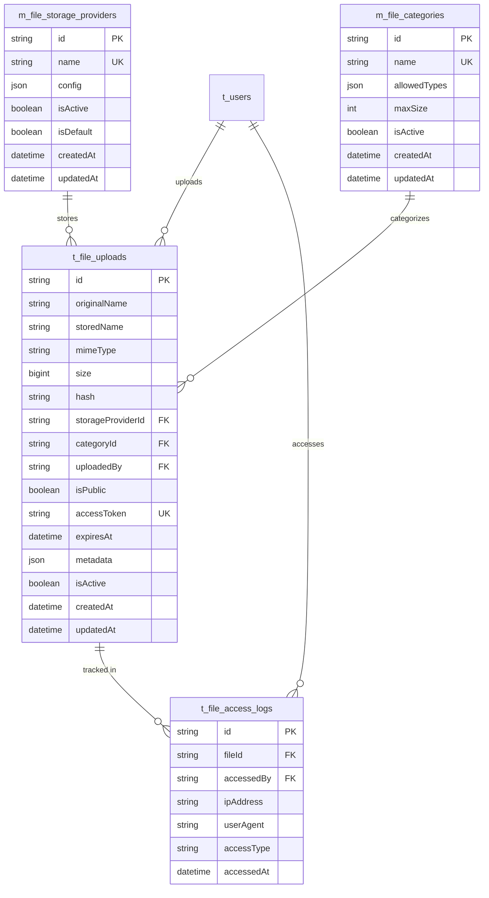

# Upload Module ERD Design

## Overview

This document outlines the database design for the upload module that handles file uploads (images, PDFs, videos) with public/private access control and cloud storage abstraction.

## Database Schema Design

### Core Entities

#### 1. File Storage Provider (m_file_storage_providers)
- **Purpose**: Abstract storage providers (local, AWS S3, Google Cloud, etc.)
- **Table**: `m_file_storage_providers`
- **Key Fields**: 
  - `id` (UUID, PK)
  - `name` (unique) - e.g., "local", "aws-s3", "google-cloud"
  - `config` (JSON) - Provider-specific configuration
  - `isActive` (Boolean)
  - `isDefault` (Boolean) - Default provider for new uploads

#### 2. File Category (m_file_categories)
- **Purpose**: Categorize files by type and purpose
- **Table**: `m_file_categories`
- **Key Fields**:
  - `id` (UUID, PK)
  - `name` (unique) - e.g., "profile-images", "documents", "course-materials"
  - `allowedTypes` (JSON) - Allowed MIME types
  - `maxSize` (Integer) - Max file size in bytes
  - `isActive` (Boolean)

#### 3. File Upload (t_file_uploads)
- **Purpose**: Main file metadata and tracking
- **Table**: `t_file_uploads`
- **Key Fields**:
  - `id` (UUID, PK)
  - `originalName` (String) - Original filename
  - `storedName` (String) - Stored filename (with UUID)
  - `mimeType` (String) - File MIME type
  - `size` (BigInt) - File size in bytes
  - `hash` (String) - File hash for deduplication
  - `storageProviderId` (UUID, FK) - Storage provider
  - `categoryId` (UUID, FK) - File category
  - `uploadedBy` (UUID, FK) - User who uploaded
  - `isPublic` (Boolean) - Public/private access
  - `accessToken` (String, unique) - Token for private access
  - `expiresAt` (DateTime) - Optional expiration
  - `metadata` (JSON) - Additional file metadata
  - `isActive` (Boolean)
  - `createdAt` (DateTime)
  - `updatedAt` (DateTime)

#### 4. File Access Log (t_file_access_logs)
- **Purpose**: Track file access for analytics and security
- **Table**: `t_file_access_logs`
- **Key Fields**:
  - `id` (UUID, PK)
  - `fileId` (UUID, FK) - File accessed
  - `accessedBy` (UUID, FK, nullable) - User who accessed (null for anonymous)
  - `ipAddress` (String) - Client IP
  - `userAgent` (String) - Client user agent
  - `accessType` (String) - "download", "view", "stream"
  - `accessedAt` (DateTime)

## Entity Relationship Diagram (Mermaid)



## Database Schema (Prisma)

```prisma
// File Storage Provider - Master Data
model FileStorageProvider {
  id        String   @id @default(uuid())
  name      String   @unique // "local", "aws-s3", "google-cloud"
  config    Json     // Provider-specific configuration
  isActive  Boolean  @default(true)
  isDefault Boolean  @default(false)
  createdAt DateTime @default(now())
  updatedAt DateTime @updatedAt

  // Relations
  fileUploads FileUpload[]

  @@map("m_file_storage_providers")
}

// File Category - Master Data
model FileCategory {
  id           String   @id @default(uuid())
  name         String   @unique // "profile-images", "documents", "course-materials"
  allowedTypes Json     // ["image/jpeg", "image/png", "application/pdf"]
  maxSize      Int      // Max file size in bytes
  isActive     Boolean  @default(true)
  createdAt    DateTime @default(now())
  updatedAt    DateTime @updatedAt

  // Relations
  fileUploads FileUpload[]

  @@map("m_file_categories")
}

// File Upload - Transactional Data
model FileUpload {
  id                String   @id @default(uuid())
  originalName      String   // Original filename
  storedName        String   // Stored filename (with UUID)
  mimeType          String   // File MIME type
  size              BigInt   // File size in bytes
  hash              String   // File hash for deduplication
  storageProviderId String
  categoryId        String
  uploadedBy        String
  isPublic          Boolean  @default(false)
  accessToken       String   @unique // Token for private access
  expiresAt         DateTime? // Optional expiration
  metadata          Json?    // Additional file metadata
  isActive          Boolean  @default(true)
  createdAt         DateTime @default(now())
  updatedAt         DateTime @updatedAt

  // Relations
  storageProvider FileStorageProvider @relation(fields: [storageProviderId], references: [id])
  category        FileCategory        @relation(fields: [categoryId], references: [id])
  uploader        User                @relation(fields: [uploadedBy], references: [id])
  accessLogs      FileAccessLog[]

  @@map("t_file_uploads")
}

// File Access Log - Transactional Data
model FileAccessLog {
  id          String   @id @default(uuid())
  fileId      String
  accessedBy  String?  // Nullable for anonymous access
  ipAddress   String
  userAgent   String
  accessType  String   // "download", "view", "stream"
  accessedAt  DateTime @default(now())

  // Relations
  file    FileUpload @relation(fields: [fileId], references: [id], onDelete: Cascade)
  user    User?      @relation(fields: [accessedBy], references: [id])

  @@map("t_file_access_logs")
}
```

## Storage Abstraction Design

### Storage Service Interface

```typescript
interface StorageService {
  // File operations
  upload(file: Buffer, key: string, metadata?: any): Promise<UploadResult>;
  download(key: string): Promise<Buffer>;
  delete(key: string): Promise<void>;
  exists(key: string): Promise<boolean>;
  
  // URL generation
  getPublicUrl(key: string): string;
  getSignedUrl(key: string, expiresIn?: number): Promise<string>;
  
  // Metadata
  getMetadata(key: string): Promise<FileMetadata>;
}

interface UploadResult {
  key: string;
  url: string;
  size: number;
  etag?: string;
}

interface FileMetadata {
  size: number;
  lastModified: Date;
  contentType: string;
  etag?: string;
}
```

### Storage Provider Implementations

1. **LocalStorageService** - Local file system
2. **S3StorageService** - AWS S3
3. **GoogleCloudStorageService** - Google Cloud Storage
4. **AzureStorageService** - Azure Blob Storage

## File Access Control

### Public Files
- Accessible via direct URL
- No authentication required
- Suitable for public content (profile images, public documents)

### Private Files
- Require access token
- Authentication required
- Suitable for sensitive content (private documents, course materials)

### Access Token System
- Generated UUID for each private file
- Optional expiration time
- Tracked in access logs

## File Categories and Validation

### Predefined Categories
1. **profile-images** - User profile pictures
2. **documents** - PDF documents
3. **course-materials** - Course content files
4. **system-assets** - System images and assets

### Validation Rules
- File type validation based on category
- File size limits per category
- MIME type verification
- File hash for deduplication

## Migration Strategy

### Phase 1: Local Storage
- Implement LocalStorageService
- Basic file upload/download
- Public/private access control

### Phase 2: Cloud Migration
- Implement cloud storage services
- Add storage provider selection
- Migrate existing files

### Phase 3: Advanced Features
- CDN integration
- Image processing
- Video streaming
- File versioning

## Security Considerations

1. **File Validation**: Strict MIME type and size validation
2. **Access Control**: Role-based access to private files
3. **Audit Trail**: Complete access logging
4. **Virus Scanning**: Integration with antivirus services
5. **Rate Limiting**: Prevent abuse of upload endpoints

## Performance Optimizations

1. **File Deduplication**: Use file hash to prevent duplicate storage
2. **CDN Integration**: Serve files through CDN for better performance
3. **Lazy Loading**: Load file metadata on demand
4. **Caching**: Cache frequently accessed files
5. **Compression**: Automatic image/video compression

This design provides a flexible, scalable foundation for file management that can easily migrate to cloud storage while maintaining security and performance.
