# Entity Relationship Diagram (ERD) - Digital Product Ecommerce System

## Overview

This document provides comprehensive guidelines for understanding and working with the database schema of the Digital Product Ecommerce System. The ERD serves as a visual and conceptual guide for developers, AI assistants, and system architects.

## Database Schema Summary

The system uses **PostgreSQL** with **Prisma ORM** and follows a comprehensive ecommerce architecture with integrated Learning Management System (LMS) capabilities for digital products.

### Core Entities

1. **Ecommerce Core**: Products, Categories, Orders, Order Items, Customers
2. **LMS System**: Courses, Chapters, Progress Tracking, Course Enrollments
3. **Discount System**: Coupons, Discounts, Promotions
4. **Digital Assets**: Product Files, Video Embeds, Download Tracking
5. **User Management**: Extended from existing user system
6. **Payment System**: Transactions, Payment Methods

## Database Table Structure Overview

```
┌─────────────────────────────────────────────────────────────────┐
│                    DATABASE TABLES                              │
├─────────────────────────────────────────────────────────────────┤
│  MASTER DATA TABLES (m_ prefix)                                │
│  ┌─────────────┬─────────────┬─────────────┬─────────────┐     │
│  │ m_categories│ m_product_types│ m_discount_types│ m_payment_methods││
│  │ m_coupons   │ m_promotions │ m_settings │ m_roles     │     │
│  │ m_permissions│ m_menus     │ m_offices  │ m_departments│    │
│  │ m_job_positions│ m_approval│ m_approval_item│           │     │
│  └─────────────┴─────────────┴─────────────┴─────────────┘     │
├─────────────────────────────────────────────────────────────────┤
│  TRANSACTIONAL DATA TABLES (t_ prefix)                         │
│  ┌─────────────┬─────────────┬─────────────┬─────────────┐     │
│  │ t_users     │ t_customers │ t_products  │ t_courses   │     │
│  │ t_orders    │ t_order_items│ t_payments │ t_enrollments│    │
│  │ t_progress  │ t_downloads │ t_refresh_tokens│ t_approvals│   │
│  └─────────────┴─────────────┴─────────────┴─────────────┘     │
├─────────────────────────────────────────────────────────────────┤
│  JUNCTION TABLES (Prisma default)                               │
│  ┌─────────────┬─────────────┬─────────────┬─────────────┐     │
│  │ _PermissionToRole│ _MenuToRole│ _ProductToCategory│ _CourseToChapter││
│  │ _OrderToCoupon│ _UserToCoupon│ _ProductToDiscount│           │     │
│  └─────────────┴─────────────┴─────────────┴─────────────┘     │
└─────────────────────────────────────────────────────────────────┘
```

## Entity Relationship Diagram (Mermaid)

```mermaid
erDiagram
    %% User Management (Extended from existing)
    t_users {
        string id PK
        string email UK
        string password
        string firstName
        string lastName
        boolean isActive
        string roleId FK
        string officeId FK
        string departmentId FK
        string jobPositionId FK
        datetime createdAt
        datetime updatedAt
        datetime lastLoginAt
    }

    t_customers {
        string id PK
        string userId FK
        string phone
        string address
        string city
        string state
        string country
        string postalCode
        datetime dateOfBirth
        string gender
        boolean isActive
        datetime createdAt
        datetime updatedAt
    }

    %% Product Management
    t_products {
        string id PK
        string name
        string slug UK
        text description
        string shortDescription
        decimal price
        decimal salePrice
        string sku UK
        string productType
        string status
        int stockQuantity
        int downloadLimit
        int viewCount
        decimal rating
        int reviewCount
        string thumbnailUrl
        string createdBy FK
        datetime createdAt
        datetime updatedAt
        boolean isActive
    }

    m_categories {
        string id PK
        string name
        string slug UK
        text description
        string imageUrl
        string parentId FK
        int order
        boolean isActive
        datetime createdAt
        datetime updatedAt
    }

    m_product_types {
        string id PK
        string name UK
        string description
        boolean isActive
        datetime createdAt
        datetime updatedAt
    }

    %% Course Management (LMS)
    t_courses {
        string id PK
        string productId FK
        string title
        string slug UK
        text description
        string thumbnailUrl
        int totalChapters
        int totalDuration
        string difficulty
        string language
        decimal rating
        int studentCount
        string instructorId FK
        string status
        boolean isPublished
        datetime publishedAt
        datetime createdAt
        datetime updatedAt
    }

    t_chapters {
        string id PK
        string courseId FK
        string title
        text description
        int order
        int duration
        string contentType
        string contentUrl
        string youtubeVideoId
        text content
        boolean isFree
        boolean isPublished
        datetime publishedAt
        datetime createdAt
        datetime updatedAt
    }

    %% Order Management
    t_orders {
        string id PK
        string orderNumber UK
        string customerId FK
        string status
        decimal subtotal
        decimal taxAmount
        decimal discountAmount
        decimal totalAmount
        string currency
        string paymentStatus
        string shippingAddress
        string billingAddress
        string notes
        datetime orderDate
        datetime createdAt
        datetime updatedAt
    }

    t_order_items {
        string id PK
        string orderId FK
        string productId FK
        string courseId FK
        int quantity
        decimal unitPrice
        decimal totalPrice
        datetime createdAt
        datetime updatedAt
    }

    %% Payment Management
    t_payments {
        string id PK
        string orderId FK
        string paymentMethodId FK
        string transactionId UK
        decimal amount
        string currency
        string status
        string gatewayResponse
        datetime processedAt
        datetime createdAt
        datetime updatedAt
    }

    m_payment_methods {
        string id PK
        string name UK
        string code UK
        string description
        boolean isActive
        datetime createdAt
        datetime updatedAt
    }

    %% Discount & Coupon System
    m_coupons {
        string id PK
        string code UK
        string name
        string description
        string discountType
        decimal discountValue
        decimal minimumAmount
        decimal maximumDiscount
        int usageLimit
        int usedCount
        datetime validFrom
        datetime validUntil
        boolean isActive
        string createdBy FK
        datetime createdAt
        datetime updatedAt
    }

    m_discount_types {
        string id PK
        string name UK
        string description
        boolean isActive
        datetime createdAt
        datetime updatedAt
    }

    m_promotions {
        string id PK
        string name
        string description
        string type
        decimal value
        datetime startDate
        datetime endDate
        boolean isActive
        string createdBy FK
        datetime createdAt
        datetime updatedAt
    }

    %% Course Enrollment & Progress
    t_enrollments {
        string id PK
        string userId FK
        string courseId FK
        string orderId FK
        string status
        datetime enrolledAt
        datetime completedAt
        decimal progress
        datetime lastAccessedAt
        datetime createdAt
        datetime updatedAt
    }

    t_progress {
        string id PK
        string enrollmentId FK
        string chapterId FK
        string status
        int timeSpent
        decimal progress
        datetime startedAt
        datetime completedAt
        datetime lastAccessedAt
        datetime createdAt
        datetime updatedAt
    }

    %% Digital Assets & Downloads
    t_product_files {
        string id PK
        string productId FK
        string fileName
        string originalName
        string filePath
        string fileType
        int fileSize
        string mimeType
        boolean isActive
        datetime createdAt
        datetime updatedAt
    }

    t_downloads {
        string id PK
        string userId FK
        string productId FK
        string fileId FK
        string ipAddress
        string userAgent
        datetime downloadedAt
    }

    %% Existing System Tables (Referenced)
    m_roles {
        string id PK
        string name UK
        string description
        boolean isActive
        datetime createdAt
        datetime updatedAt
    }

    m_permissions {
        string id PK
        string name UK
        string description
        boolean isActive
        datetime createdAt
        datetime updatedAt
    }

    m_offices {
        string id PK
        string name
        string code UK
        string description
        string address
        string phone
        string email
        string parentId FK
        boolean isActive
        datetime createdAt
        datetime updatedAt
    }

    m_departments {
        string id PK
        string name
        string code UK
        text description
        boolean isActive
        datetime createdAt
        datetime updatedAt
    }

    m_job_positions {
        string id PK
        string name
        string code UK
        int level
        text description
        boolean isActive
        datetime createdAt
        datetime updatedAt
    }

    m_menus {
        string id PK
        string name
        string path
        string icon
        string parentId FK
        int order
        boolean isActive
        datetime createdAt
        datetime updatedAt
    }

    m_settings {
        string id PK
        string key UK
        string value
        boolean isActive
        datetime createdAt
        datetime updatedAt
    }

    t_refresh_tokens {
        string id PK
        string token UK
        string userId FK
        datetime expiresAt
        datetime createdAt
    }

    %% Relationships - User Management
    t_users ||--o{ t_refresh_tokens : "has many"
    t_users ||--o| t_customers : "has customer profile"
    t_users }o--|| m_roles : "belongs to"
    t_users }o--|| m_offices : "belongs to"
    t_users }o--o| m_departments : "optional belongs to"
    t_users }o--o| m_job_positions : "optional belongs to"

    %% Relationships - Product Management
    t_products }o--|| t_users : "created by"
    t_products }o--o{ t_product_files : "has files"
    t_products }o--o{ t_downloads : "downloaded"
    t_products }o--o{ t_order_items : "ordered"
    t_products }o--o{ t_courses : "can be course"

    m_categories ||--o{ m_categories : "parent-child hierarchy"
    m_categories }o--o{ t_products : "categorized"

    %% Relationships - Course Management
    t_courses }o--|| t_products : "based on product"
    t_courses }o--|| t_users : "instructor"
    t_courses ||--o{ t_chapters : "has chapters"
    t_courses }o--o{ t_enrollments : "enrolled"
    t_courses }o--o{ t_order_items : "ordered"

    t_chapters }o--|| t_courses : "belongs to"
    t_chapters }o--o{ t_progress : "progress tracked"

    %% Relationships - Order Management
    t_orders }o--|| t_customers : "belongs to"
    t_orders ||--o{ t_order_items : "has items"
    t_orders ||--o{ t_payments : "has payments"
    t_orders }o--o{ t_enrollments : "creates enrollments"

    t_order_items }o--|| t_orders : "belongs to"
    t_order_items }o--o| t_products : "references product"
    t_order_items }o--o| t_courses : "references course"

    %% Relationships - Payment Management
    t_payments }o--|| t_orders : "belongs to"
    t_payments }o--|| m_payment_methods : "uses method"

    %% Relationships - Discount System
    m_coupons }o--|| t_users : "created by"
    m_coupons }o--o{ t_orders : "applied to orders"

    m_promotions }o--|| t_users : "created by"
    m_promotions }o--o{ t_products : "applies to products"

    %% Relationships - Course Enrollment & Progress
    t_enrollments }o--|| t_users : "student"
    t_enrollments }o--|| t_courses : "enrolled in"
    t_enrollments }o--o| t_orders : "created by order"
    t_enrollments ||--o{ t_progress : "has progress"

    t_progress }o--|| t_enrollments : "belongs to"
    t_progress }o--|| t_chapters : "tracks chapter"

    %% Relationships - Digital Assets
    t_product_files }o--|| t_products : "belongs to"
    t_downloads }o--|| t_users : "downloaded by"
    t_downloads }o--|| t_products : "product downloaded"
    t_downloads }o--o| t_product_files : "specific file"

    %% Relationships - Existing System
    m_roles ||--o{ t_users : "has many"
    m_roles }o--o{ m_permissions : "many-to-many"
    m_roles }o--o{ m_menus : "many-to-many"

    m_offices ||--o{ t_users : "has many"
    m_offices ||--o{ m_offices : "parent-child hierarchy"

    m_departments ||--o{ t_users : "has many"
    m_job_positions ||--o{ t_users : "has many"
    m_menus ||--o{ m_menus : "parent-child hierarchy"
```



## Entity Descriptions

### 1. Ecommerce Core

#### Product
- **Primary Entity**: Digital products (ebooks, courses, videos)
- **Key Fields**: name, slug (unique), price, productType, status
- **Product Types**: EBOOK, COURSE, VIDEO, BUNDLE
- **Relationships**: 
  - Belongs to: User (creator), Category
  - One-to-Many: ProductFiles, Downloads, OrderItems
  - One-to-One: Course (if productType is COURSE)

#### Category
- **Purpose**: Hierarchical product categorization
- **Key Fields**: name, slug (unique), parentId (self-reference)
- **Relationships**: 
  - Self-referencing hierarchy (parent-child)
  - Many-to-Many with Products

#### Customer
- **Purpose**: Extended user profile for ecommerce
- **Key Fields**: userId (unique), phone, address
- **Relationships**: 
  - One-to-One with User
  - One-to-Many: Orders

### 2. LMS System

#### Course
- **Purpose**: Learning management system courses
- **Key Fields**: title, slug (unique), instructorId, status
- **Relationships**: 
  - Belongs to: Product, User (instructor)
  - One-to-Many: Chapters, Enrollments, OrderItems

#### Chapter
- **Purpose**: Course content chapters/lessons
- **Key Fields**: title, order, contentType, contentUrl
- **Content Types**: VIDEO, PDF, TEXT, YOUTUBE
- **Relationships**: 
  - Belongs to: Course
  - One-to-Many: Progress

#### Enrollment
- **Purpose**: Student course enrollments
- **Key Fields**: userId, courseId, status, progress
- **Relationships**: 
  - Belongs to: User, Course, Order (optional)
  - One-to-Many: Progress

#### Progress
- **Purpose**: Track student learning progress
- **Key Fields**: enrollmentId, chapterId, status, timeSpent
- **Relationships**: 
  - Belongs to: Enrollment, Chapter

### 3. Order Management

#### Order
- **Purpose**: Customer purchase orders
- **Key Fields**: orderNumber (unique), customerId, totalAmount, status
- **Relationships**: 
  - Belongs to: Customer
  - One-to-Many: OrderItems, Payments, Enrollments

#### OrderItem
- **Purpose**: Individual items in an order
- **Key Fields**: orderId, productId/courseId, quantity, unitPrice
- **Relationships**: 
  - Belongs to: Order
  - References: Product or Course

### 4. Discount System

#### Coupon
- **Purpose**: Discount codes for customers
- **Key Fields**: code (unique), discountType, discountValue, usageLimit
- **Discount Types**: PERCENTAGE, FIXED_AMOUNT
- **Relationships**: 
  - Belongs to: User (creator)
  - Many-to-Many with Orders

#### Promotion
- **Purpose**: Product-specific promotions
- **Key Fields**: name, type, value, startDate, endDate
- **Relationships**: 
  - Belongs to: User (creator)
  - Many-to-Many with Products

### 5. Digital Assets

#### ProductFile
- **Purpose**: Digital files for products
- **Key Fields**: productId, fileName, filePath, fileType, fileSize
- **Relationships**: 
  - Belongs to: Product
  - One-to-Many: Downloads

#### Download
- **Purpose**: Track file downloads
- **Key Fields**: userId, productId, fileId, downloadedAt
- **Relationships**: 
  - Belongs to: User, Product, ProductFile (optional)

### 6. Payment System

#### Payment
- **Purpose**: Payment transactions
- **Key Fields**: orderId, transactionId (unique), amount, status
- **Relationships**: 
  - Belongs to: Order, PaymentMethod

## Relationship Patterns

### 1. Hierarchical Relationships
- **Category**: Self-referencing parent-child hierarchy
- **Office**: Self-referencing parent-child hierarchy (existing)
- **Menu**: Self-referencing parent-child hierarchy (existing)

### 2. Polymorphic Relationships
- **OrderItem**: Can reference either Product or Course
- **Product**: Can be standalone or have associated Course

### 3. Many-to-Many Relationships
- **Role ↔ Permission**: Roles can have multiple permissions (existing)
- **Role ↔ Menu**: Roles can access multiple menus (existing)
- **Product ↔ Category**: Products can belong to multiple categories
- **Coupon ↔ Order**: Coupons can be applied to multiple orders
- **Promotion ↔ Product**: Promotions can apply to multiple products

### 4. Optional Relationships
- **User → Department**: Optional (existing)
- **User → JobPosition**: Optional (existing)
- **OrderItem → Course**: Optional (only if item is a course)
- **Download → ProductFile**: Optional (specific file download)

## Database Constraints

### Primary Keys
- All entities use UUID primary keys (`@id @default(uuid())`)

### Table Naming Convention
- **Master Data Tables**: Prefixed with `m_` (m_categories, m_product_types, m_coupons, etc.)
- **Transactional Data Tables**: Prefixed with `t_` (t_products, t_orders, t_courses, etc.)
- **Junction Tables**: Prisma default naming (_ProductToCategory, _CouponToOrder, etc.)

### Unique Constraints
- `t_users.email` - Unique email addresses (existing)
- `t_products.slug` - Unique product slugs
- `t_products.sku` - Unique product SKUs
- `t_courses.slug` - Unique course slugs
- `t_orders.orderNumber` - Unique order numbers
- `t_payments.transactionId` - Unique transaction IDs
- `m_coupons.code` - Unique coupon codes
- `m_categories.slug` - Unique category slugs

### Foreign Key Constraints
- **Cascade Updates**: All foreign keys use `ON UPDATE CASCADE`
- **Restrict Deletes**: Most foreign keys use `ON DELETE RESTRICT`
- **Set Null Deletes**: Optional relationships use `ON DELETE SET NULL`

## Data Flow Patterns

### 1. Product Purchase Flow
```
Customer → Order → OrderItem → Product/Course → Enrollment (if course)
```

### 2. Course Learning Flow
```
User → Enrollment → Course → Chapter → Progress
```

### 3. Digital Download Flow
```
User → Order → Product → ProductFile → Download
```

### 4. Discount Application Flow
```
Coupon → Order → Discount Calculation
Promotion → Product → Price Adjustment
```

## AI Assistant Guidelines

### When Working with This Schema:

1. **Always Consider Relationships**: When querying products, include related entities (category, files, course if applicable)

2. **Handle Product Types**: 
   - EBOOK: Has ProductFiles for download
   - COURSE: Has associated Course entity with Chapters
   - VIDEO: Can be YouTube embed or hosted video
   - BUNDLE: Contains multiple products

3. **Respect Enrollments**: 
   - Users must be enrolled to access course content
   - Track progress through chapters
   - Handle course completion logic

4. **Manage Digital Assets**: 
   - PDFs and files stored as ProductFiles
   - Videos can be YouTube embeds or hosted files
   - Track downloads for analytics

5. **Handle Discounts**: 
   - Apply coupons to orders
   - Apply promotions to products
   - Calculate final prices correctly

6. **Consider Soft Deletes**: 
   - Most entities have `isActive` field
   - Filter by `isActive: true` for active records

### Common Query Patterns:

```typescript
// Get product with all relationships
const product = await prisma.product.findUnique({
  where: { id: productId },
  include: {
    category: true,
    files: true,
    course: true,
    createdBy: true
  }
});

// Get user's enrolled courses with progress
const enrollments = await prisma.enrollment.findMany({
  where: { userId: userId },
  include: {
    course: {
      include: {
        chapters: {
          orderBy: { order: 'asc' }
        }
      }
    },
    progress: {
      include: {
        chapter: true
      }
    }
  }
});

// Get order with items and applied discounts
const order = await prisma.order.findUnique({
  where: { id: orderId },
  include: {
    customer: true,
    items: {
      include: {
        product: true,
        course: true
      }
    },
    payments: true,
    coupons: true
  }
});

// Get course chapters for student
const chapters = await prisma.chapter.findMany({
  where: {
    course: {
      enrollments: {
        some: {
          userId: userId,
          status: 'ACTIVE'
        }
      }
    }
  },
  orderBy: { order: 'asc' }
});
```

## Migration Guidelines

### When Adding New Entities:
1. Follow the established naming conventions
2. Include standard fields: `id`, `createdAt`, `updatedAt`, `isActive`
3. Use appropriate foreign key constraints
4. Add unique constraints where needed
5. Update seed files for new entities

### When Modifying Existing Entities:
1. Consider impact on existing relationships
2. Update related seed files
3. Test migration with existing data
4. Update DTOs and services accordingly

## Security Considerations

### Data Protection:
- Passwords are hashed (not stored in plain text)
- Sensitive fields excluded from DTOs
- Role-based access control enforced
- Digital files access controlled by purchase/enrollment

### Audit Requirements:
- Track creation and modification timestamps
- Track who created products and courses
- Maintain download and access logs
- Track course progress and completion

### Content Security:
- PDF files stored securely with access control
- YouTube videos embedded (not downloaded)
- Download limits enforced per purchase
- Progress tracking for course completion

This ERD serves as the authoritative reference for understanding the database structure and relationships in the Digital Product Ecommerce System. Use it to guide development, debugging, and system understanding. 🚀
